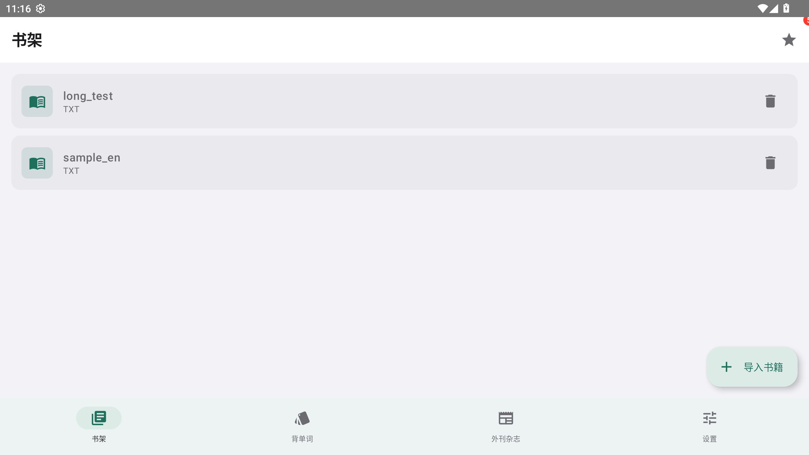
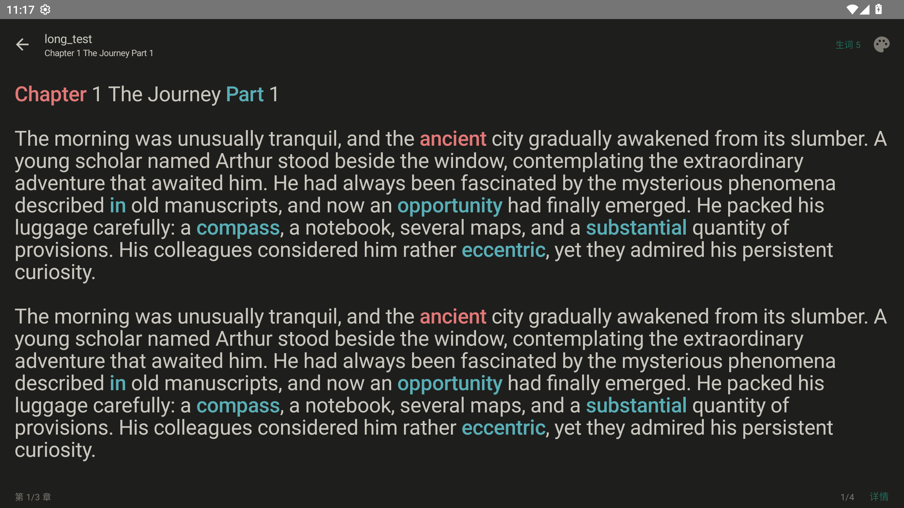
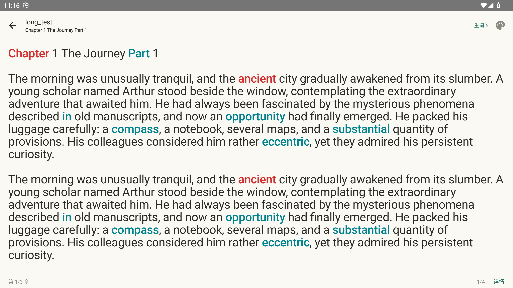
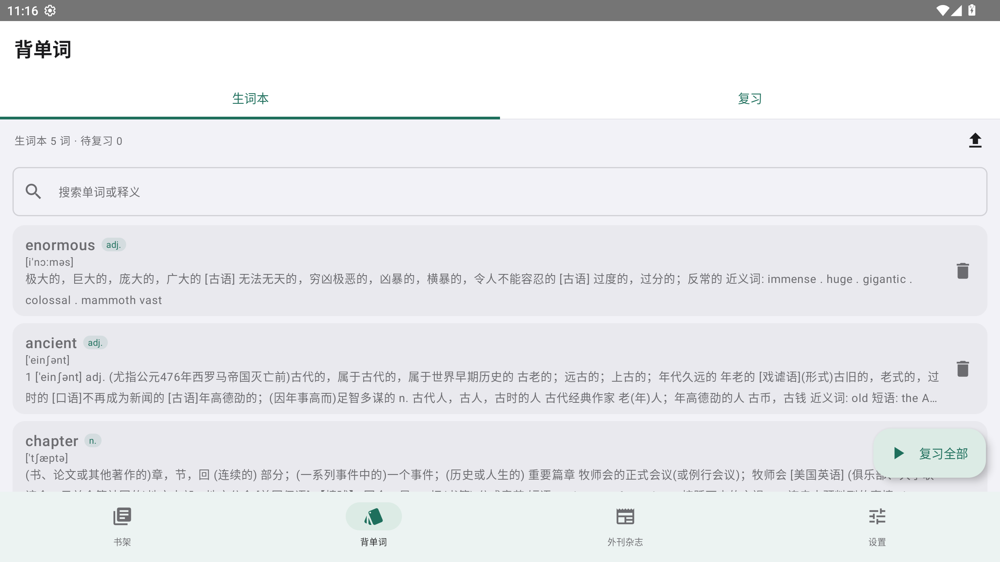
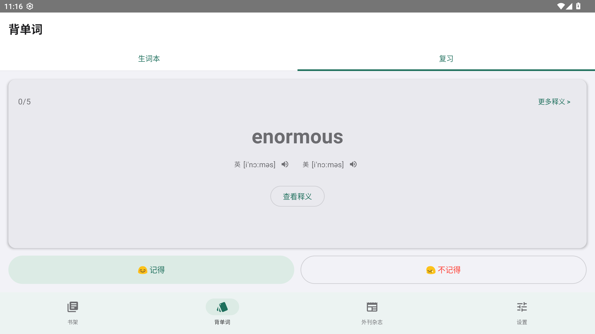
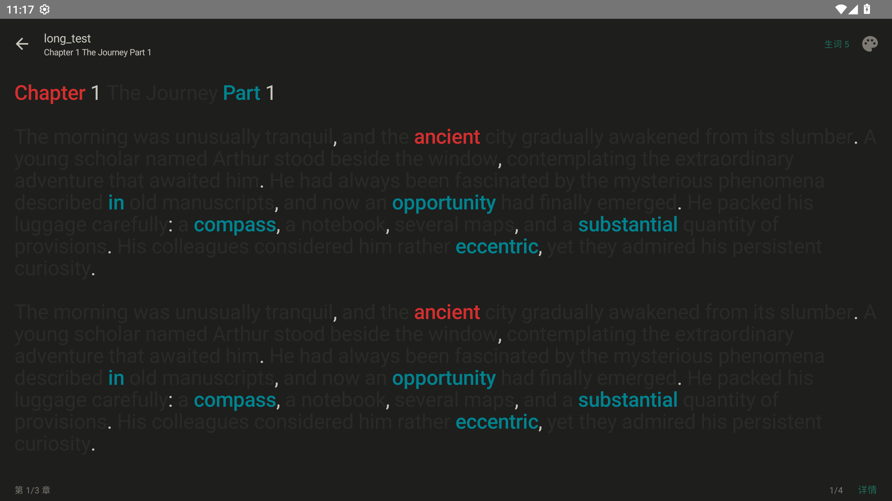

# LingReader


**本地优先的英语阅读学习 App** — 点词查词、分级词汇高亮、生词本、背单词、句子翻译、自动发音。
词典与分级词库**完全离线、无次数限制、无 VIP 门槛**。

<br clear="left">

[](#环境依赖)
[](#环境依赖)
[](#环境依赖)
[](#环境依赖)
[](#许可证)

---

## 简介

LingReader 面向「读英文原著 / 外刊」的学习场景：把生词查询、分级词汇标记、生词沉淀、间隔重复复习串成一条完整链路。
**所有词典查询都在本地完成**，不联网也能用，不用担心次数或额度。

- **离线词典**：33.2 万词条英汉词典（含音标），点任意单词秒出释义
- **分级高亮**：39,256 词条覆盖 CET4 / CET6 / 考研 / 专四 / 专八 / GRE / 雅思 / 托福 / 高中 / BEC，逐级配色
- **生词沉淀**：查词弹层一键收藏，自动带上音标、词性、所在原句与来源书目
- **科学复习**：SM-2 间隔重复，自动排程到期词
- **可插拔翻译**：默认走**免 Key 的免费在线接口**，装好即可翻译；也可自填 DeepL / 百度 / 腾讯云 / OpenAI 兼容 的 Key，不绑定厂商

## 功能列表

| 模块 | 功能 |
|---|---|
| **阅读** | TXT / EPUB / FB2 / HTML 导入；自动探测 UTF-8/GBK/BOM；章节自动切分；阅读进度记忆 |
| **阅读交互** | 左右滑动翻页；下拉手势调字号/行距/背景；右下角「详情」查看章节与统计；纸白 / 米黄 / 夜间三套配色 |
| **查词** | 点击单词即查；词形还原（`books`→`book`、`running`→`run`）；音标；自动发音（系统 TTS，无引擎时自动走在线兜底）；美音 / 英音切换；语速 0.5×~2.0× |
| **分级高亮** | 10 个级别可逐级开关；生词本词红色高亮；阅读页内即时切换 |
| **生词本** | 列表只展示「单词 / 词性 / 音标 / 含义」，词性显示为中文（`adv.`→`副词`）；**变形词（`simultaneously` 等）直接显示源词中文释义**，不再是一句「simultaneous的变形」；整行点击朗读；搜索；导出 CSV / JSON |
| **背单词** | 自动播报美音；记得 / 不记得 / 查看释义三选项；不记得的先跳过、稍后重现；实时进度；展开释义后原文句子下方显示**整句译文** |
| **翻译** | 默认**免费在线**（免 Key，有道 → MyMemory → Google 依次兜底）；可切换 DeepL / 百度 / 腾讯云（TC3-HMAC-SHA256）/ OpenAI 兼容；长按整句直接进入翻译 |
| **设置** | 界面配色、发音、阅读显示、分级高亮、翻译引擎、数据统计 |
| **导航** | 底部导航：书架 / 背单词 / 外刊杂志（规划中）/ 设置 |

## 截图

| 书架 | 阅读（分级高亮） | 点词查词 |
|---|---|---|
|  |  |  |

| 生词本 | 背单词 | 夜间模式 |
|---|---|---|
|  |  |  |

> 截图尚未提交，命名规范与抓取方式见 [`docs/screenshots/README.md`](docs/screenshots/README.md)。

## 环境依赖

| 依赖 | 版本要求 | 说明 |
|---|---|---|
| JDK | **17 ~ 21** | ⚠️ Java 25 会导致 Gradle 8.9 启动失败 |
| Android SDK | Platform **android-33** | 缺失时 AGP 会自动联网下载 |
| Build Tools | **34.0.0** | `33.0.1` 不存在，故显式指定 34.0.0 |
| Gradle | **8.9** | 由仓库自带的 `gradlew` 固定，无需本机安装 |
| AGP / Kotlin | 8.1.4 / 1.8.10 | |
| Compose | 1.4.3 + material3 1.1.2 | 适配 `compileSdk 33` |
| minSdk / targetSdk / compileSdk | 24 / 33 / 33 | |

**运行时权限**：`INTERNET`（在线翻译 + **词典按需下载**）、`ACCESS_NETWORK_STATE`。词典下载完成后，查词 / 背单词全部离线。

## 编译构建 APK

```powershell
git clone https://github.com/<your-name>/ling-reader.git
cd ling-reader

# 1) 指向本机 SDK
"<ANDROID_SDK>\android-sdk" | ForEach-Object { "sdk.dir=$_" } | Set-Content local.properties

# 2) 指定 JDK 17~21（关键，务必不要用 Java 25）
$env:JAVA_HOME = '<你的 JDK 17/20/21 路径>'

# 3) 构建
.\gradlew.bat assembleDebug --console=plain
```

产物：`app/build/outputs/apk/debug/app-debug.apk`（约 **19 MB** —— 词典改为按需下载，安装包不再含 120 MB 词典）

```powershell
# 安装到设备
adb install -r app\build\outputs\apk\debug\app-debug.apk
```

> v1.1.0 起主词典**改为按需下载**（设置 → 本地词典，约 115MB，默认走 GitHub Release），
> 下载后落盘在应用私有目录且**路径与旧版一致**，老用户升级可直接复用、无需重新下载。
> 未下载时 App 完全可用（阅读 / 分级高亮 / 生词本），只是点词没有释义。

**发布版打包**

```powershell
.\gradlew.bat assembleRelease
```

如需签名，在 `app/build.gradle.kts` 增加 `signingConfigs`，并把 keystore 放在仓库外（已在 `.gitignore` 中排除 `*.jks` / `*.keystore`）。

## 安装与升级（用户数据安全）

- `applicationId` 固定为 `com.lreader`，**升级安装不会清数据**
- 生词本数据库采用「**缺列补列**」非破坏性迁移，`onUpgrade` / `onDowngrade` 都不会 `DROP TABLE`
- 书架（`bookshelf.json`）、设置（`settings.json`）均为独立文件，升级不覆盖
- 覆盖安装命令：`adb install -r app-debug.apk`（同一签名即可保留数据）
- **词典文件**：落盘名 `filesDir/dict_en_zh.db`，v1.0.x → v1.1.0 升级路径不变，已下载的词典**不会被再次下载**

---

## 📌 给 AI Agent 的阅读指引（重要）

**如果你是新接手本项目的 AI Agent，请先读这一节。**

1. 本 README 是项目的**唯一权威说明文档**，包含：架构、模块职责、数据流、构建方式、版本历史。
2. 用户若说「阅读该 README 帮我开发 XXX」，请：
   - 先通读本文档（尤其是 §3 目录结构、§4 模块职责、§6 开发约定）；
   - 定位到要改动的模块，阅读对应源文件后再动手；
   - **遵守 §6 的每一条约定**（例如：不要引入 Room/Hilt、保持纯本地、勿改动 assets 词典的存储格式）。
3. **每次完成新需求后，必须更新本文档**：
   - 在 §8 版本历史中**新增一个版本号**，写清「新增/修改/修复」了什么；
   - 同步更新 §2 功能清单、§3 目录结构、§4 模块职责（如有变化）；
   - 同步更新 `app/build.gradle.kts` 中的 `versionCode` / `versionName`。
4. 若用户需求与本项目的合规边界冲突（例如要求「复刻某个商业 App 的代码/UI」），**拒绝并说明**（详见 §9）。

---

## 1. 项目概览

| 项目 | 值 |
|---|---|
| 应用名 | **LingReader**（包名仍为 `com.lreader`，不可变更以保数据） |
| 包名 | `com.lreader` |
| 语言 | Kotlin |
| UI | Jetpack Compose（Material 3） |
| minSdk / targetSdk / compileSdk | 24 / 33 / 33 |
| AGP / Gradle / Kotlin | 8.1.4 / 8.9 / 1.8.10 |
| Compose | Compose 1.4.3 + Compiler 1.4.3 + material3 1.1.2 |
| 构建产物 | `app/build/outputs/apk/debug/app-debug.apk`（实测 20171695 B ≈ 19.2 MB，词典改为按需下载后） |
| 当前版本 | **v1.1.0**（`versionCode` = 11、`versionName` = `1.1.0`） |

### 设计原则

- **纯本地**：词典、分级词库、生词本全部离线，无网络也能查词/背单词。
- **零重型依赖**：不引入 Room / Hilt / Retrofit；用原生 `SQLiteOpenHelper` + `JSON` + `OkHttp`。
- **词典按需下载**：主词典（约 115MB）**不随包内置**，用户在 设置 → 本地词典 里下载
  （默认 GitHub Release，可改成镜像 / 自建服务器）；小体积的分级词库仍随包内置。
  落盘路径 `filesDir/dict_en_zh.db` 与 v1.0.x 完全一致 —— **老用户升级后直接复用，无需重新下载**。
- **可插拔翻译**：翻译引擎通过接口注册；默认内置**免 Key 的免费在线引擎**（开箱即用），也支持自填 API Key，不绑定任何厂商。

---

## 2. 功能明细（含实现状态）

> 概览见上方「功能列表」，本节是逐模块的详细拆解。

### 2.1 阅读

| 功能 | 说明 | 状态 |
|---|---|---|
| 多格式导入 | **TXT**（自动探测 UTF-8/GBK/BOM）、**EPUB**（OPF/spine 解析）、**FB2**、**HTML** | ✅ |
| 章节切分 | TXT 按「第X章 / Chapter N」正则切分，无标题则按 ~8000 字分段 | ✅ |
| 阅读进度 | 记忆「当前章节 + 滚动位置」，下次打开续读 | ✅ |
| 显示调节 | 字号 13~26sp、行距 20~44sp 可调 | ✅ |
| 章节导航 | 底部「上一章 / 下一章」+ 进度显示 | ✅ |

### 2.2 查词

| 功能 | 说明 | 状态 |
|---|---|---|
| 点词查词 | 点击正文英文单词 → 底部弹出释义（WebView 渲染 HTML） | ✅ |
| 长按选词 | 长按正文任意单词 → 高亮该词并显示两条光标手柄，再次点词即查词 | ✅ |
| 选区拖拽 | 长按后左右拖动可扩选成短语；松手后光标**保留**，可继续拖动两端手柄调整选区 | ✅ |
| 选区吸附 | 选区端点自动吸附到单词边界（`SnapBoundary`），不会选中半个词 | ✅ |
| 词形还原 | `books`→`book`、`running`→`run`、`studies`→`study`、`bigger`→`big` 等 | ✅ |
| 变形词补全 | `abruptly` 这类词条词典只收 `adv. abrupt的变形`（无中文），自动补上源词释义并继承音标 | ✅ |
| 自动发音 | 点词即朗读（系统 TTS，可开关） | ✅ |
| 在线兜底 | 设备无系统语音引擎时自动改用在线发音，保证「点了就有声音」 | ✅ |
| 语音自检 | 设置页显示当前发声通道（系统引擎 / 在线兜底）+ 一键跳系统语音设置 | ✅ |
| 口音切换 | 美音 / 英音 | ✅ |
| 语速调节 | 0.5x ~ 2.0x | ✅ |
| 词典规模 | 33.2 万词条（21世纪大英汉词典，含音标），**按需下载**：设置页带进度 / 取消 / 删除 | ✅ |
| 词典未下载 | 弹层明说「本地词典未下载 + 去设置下载」，不会误报成「未收录」；阅读页底部常驻提示条 | ✅ |

### 2.3 分级词汇高亮

| 功能 | 说明 | 状态 |
|---|---|---|
| 分级词库 | **39,256 词条 / 10 个级别** | ✅ |
| 级别列表 | CET4、CET6、考研、专四(TEM4)、专八(TEM8)、GRE、雅思(IELTS)、托福(TOEFL)、高中、BEC | ✅ |
| 独立配色 | 每级一个颜色，阅读时着色显示 | ✅ |
| 开关控制 | 设置页逐级勾选开关 | ✅ |
| 多级别归属 | 一个词同属多级时取**最容易**的一级着色（`unlikely` = 四级+雅思 → 四级色） | ✅ |
| 忽略基础词 | 勾选雅思/托福等较高级别时，不再高亮同时属于**高中/四级/六级**的词；只勾这三档时不生效 | ✅ |
| 生词高亮 | 已加入生词本的词以**红色**高亮（可关） | ✅ |

### 2.4 生词本

| 功能 | 说明 | 状态 |
|---|---|---|
| 一键收藏 | 查词弹层右上角「+」加入生词本；已收藏显示「✓」 | ✅ |
| 完整信息 | 单词、释义、音标、**所在原句**、来源书名、级别 | ✅ |
| 列表页 | 搜索（词/释义）、发音、删除、复习次数与下次复习日期 | ✅ |
| 角标提示 | 书架页 ★ 图标带未读数量角标 | ✅ |

### 2.5 背单词

| 功能 | 说明 | 状态 |
|---|---|---|
| 复习算法 | **SM-2 间隔重复**（SuperMemo 2） | ✅ |
| 三档评级 | 认识(5) / 模糊(3) / 不认识(0) | ✅ |
| 自动排程 | 按 EF 系数计算下次复习时间，到期词优先 | ✅ |
| 卡片式 UI | 先显示单词+音标+发音，点「显示释义」后评分 | ✅ |
| 学习统计 | 完成后显示「本次复习 N 个，认识 M 个」 | ✅ |

### 2.6 句子翻译

| 功能 | 说明 | 状态 |
|---|---|---|
| 引擎接口 | `TranslationEngine` 可插拔 | ✅ |
| 默认引擎 | **免费在线**（`FreeWebTranslator`）：免 API Key，依次尝试 有道体验接口 → MyMemory → Google，一个不通自动换下一个 | ✅ |
| 已实现引擎 | **免费在线**(默认)、**DeepL**、**百度翻译**、**腾讯云翻译**(TC3-HMAC-SHA256)、**OpenAI 兼容**(GPT/DeepSeek/任意兼容平台) | ✅ |
| 译文缓存 | `TranslationEngines.translate()` 内建 LRU（128 句），同句不重复联网 | ✅ |
| 交互 | 查词弹层内点「翻译」→ 翻译该词所在句子 | ✅ |
| 背单词整句译文 | 展开释义后，原文句子下方**自动**显示整句译文（含加载态与失败重试） | ✅ |
| 选词翻译 | 长按拖选**多个词** → 松开即弹 `SentenceSheet` 翻译选区文本（单次最多 500 字） | ✅ |
| 独立弹层 | `SentenceSheet` 支持整句 / 选区文本翻译展示 | ✅ |
| 兜底提示 | 默认引擎永远可用；用户选的引擎没配 Key 时自动回落到免费在线，并注明实际引擎 | ✅ |

### 2.7 设置

| 分组 | 项 |
|---|---|
| 本地词典 | **词典资源管理**：下载 / 进度 / 取消 / 删除、显示真实下载地址、下载源自定义（默认 GitHub Release）；另显示分级词库与生词本统计 |
| 发音 | 自动发音开关、口音(美/英)、语速、**发音自检**（当前发声通道 + 打开系统语音设置） |
| 阅读显示 | 字号、行距 |
| 分级高亮 | 生词高亮开关、**忽略基础词**开关、10 个级别的勾选框（含词数） |
| 翻译引擎 | 引擎选择：**免费在线（默认，无需填 Key）** + 8 个输入框（DeepL / 百度 AppID+Key / 腾讯 SecretId+Key / OpenAI Key+地址+模型） |

---

## 3. 目录结构

```
ereader/                           # = 工作区上级目录 e:\ai_project\ling_reader\
├── EReader-For-Android.apk        # 参考用原始 APK（不属于本工程，勿拷贝其代码/资源）
├── TheEconomist.2026.09.19.epub   # EPUB 导入测试样本
├── work/  ⚠️ 当前工作区已缺失        # 词典构建工具链（Python）+ 原始词典源
│   ├── extracted/assets/dict/     #   ├─ 21_en_zh.mdx (25.8MB) 原始 MDict 词典
│   │                              #   └─ 21_en_zh.css  配套样式
│   ├── extracted/assets/db/       #   ├─ english_words.db (5.1MB) 分级词库源
│   │                              #   └─ es_words.db / fr_words.db 西语/法语词库
│   ├── mdx2sqlite.py              # MDX → SQLite 转换脚本
│   ├── shrink_dict.py             # 词典 HTML 精简 + zlib 压缩
│   ├── export_levels.py           # 分级词库导出脚本
│   └── verify_dict.py             # 词典校验脚本
│
└── lreader/                       # ★ Android 工程根目录
    ├── README.md                  # 本文档
    ├── dict-assets/               # 词典发布资源（已 .gitignore）：dict_en_zh.min.db，需上传 GitHub Release，见 §7.7
    ├── settings.gradle.kts        # 仓库配置（含阿里云镜像）
    ├── build.gradle.kts           # 根构建（AGP 8.1.4 / Kotlin 1.8.10）
    ├── gradle.properties
    ├── local.properties           # sdk.dir=E:\Android_Sdk（勿提交）
    ├── gradlew                    # ★ Gradle Wrapper（v1.0.2 补入）
    ├── gradlew.bat
    ├── gradle/wrapper/
    │   ├── gradle-wrapper.jar
    │   └── gradle-wrapper.properties   # distributionUrl = gradle-8.9-bin.zip
    └── app/
        ├── build.gradle.kts       # 模块构建（compileSdk 33 / 依赖清单）
        ├── proguard-rules.pro
        └── src/main/
            ├── AndroidManifest.xml
            ├── assets/
            │   └── levels.db          # 4.6MB(4,800,512B) 分级词库（3.9万词条，随包内置）
            │                          # ※ 主词典 dict_en_zh.min.db 已移出 assets，改从 GitHub Release 下载
            ├── res/                   # 图标、主题、字符串；xml/network_security_config.xml 放行 http 下载源
            └── java/com/lreader/
                ├── LRreaderApp.kt             # Application：初始化翻译引擎
                ├── MainActivity.kt            # 唯一 Activity，承载 Compose
                │
                ├── model/
                │   └── Models.kt              # 全部数据类
                │
                ├── dict/
                │   ├── DictCatalog.kt         # 词典资源清单 + 默认下载源（GitHub Release 常量）
                │   ├── DictManager.kt         # ★ 资源安装管理：内置释放 / 下载(进度·取消) / 校验 / 删除
                │   ├── DictDatabase.kt        # 主词典查询（只打开已下载的库）
                │   └── LevelDictionary.kt     # 分级词库查询
                │
                ├── analysis/
                │   └── WordAnalysis.kt        # 词性 / 纯释义 / 原句切分（纯 Kotlin）
                │
                ├── export/
                │   └── VocabExporter.kt       # 生词本导出 CSV / JSON（独立模块）
                │
                ├── speech/
                │   └── SpeechManager.kt       # TTS 发音封装
                │
                ├── translate/
                │   ├── TranslationEngine.kt   # 引擎接口（扩展点）
                │   ├── Translators.kt         # 5 个引擎实现（含免 Key 的免费在线引擎，默认）
                │   └── TranslationEngines.kt  # 注册中心 + Key 持久化
                │
                ├── data/
                │   ├── BookRepository.kt      # 书架（JSON 持久化）
                │   ├── VocabRepository.kt     # 生词本（SQLite + SM-2）
                │   └── SettingsStore.kt       # 设置（JSON 持久化）
                │
                ├── book/
                │   └── BookParser.kt          # TXT/EPUB/FB2/HTML 解析
                │
                └── ui/
                    ├── AppNavHost.kt          # 导航图 + 底部导航 + 路由定义
                    ├── theme/AppTheme.kt      # 全局视觉规范（集中调色）
                    ├── study/StudyScreen.kt   # 背单词 Tab（生词本/复习 二级切换）
                    ├── magazine/MagazineScreen.kt # 外刊杂志（占位页）
                    ├── shelf/ShelfScreen.kt   # 书架页
                    ├── reader/
                    │   ├── ReaderScreen.kt    # 阅读页（核心，分页/滑动/下拉调参/长按选词）
                    │   ├── ReadingTheme.kt    # 阅读配色：纸白 / 米黄 / 夜间
                    │   ├── TextSelection.kt   # 选区模型 + 光标手柄渲染/拖动（独立模块）
                    │   └── DictBottomSheet.kt # 查词弹层 + 选句翻译弹层
                    ├── vocab/
                    │   ├── VocabScreen.kt     # 生词本列表
                    │   └── ReviewScreen.kt    # 背单词
                    └── settings/SettingsScreen.kt # 设置页（含词典资源管理区块）
```

---

## 4. 模块职责说明

### 4.1 数据模型 `model/Models.kt`

| 类型 | 用途 |
|---|---|
| `Book` | 书籍元信息（id 用绝对路径、格式、上次阅读章节/滚动位置） |
| `BookFormat` | 枚举 TXT/EPUB/FB2/HTML/UNKNOWN + MIME 数组 |
| `Chapter` | 章节（index、title、content） |
| `DictEntry` | 查词结果（word、html、dictionaryName、level、levelName、phonetic） |
| `VocabWord` | 生词本条目（含 SM-2 的 repetition/interval/easiness/grade/nextReview） |
| `ReviewGrade` | 复习评级枚举 FORGOT(0)/VAGUE(3)/KNOWN(5) |
| `TranslationResult` | 翻译结果（sourceText、translatedText、engine、success、errorMessage） |
| `LevelConfig` | 分级配置（level、displayName、enabled、color） |

### 4.2 词典层

**`dict/DictCatalog.kt`** — 词典资源清单（v1.1.0 新增）
- `DictResource`：`id` / 展示名 / 说明 / `fileName`（落盘名）/ `remoteFile`（附件名）/ `sizeBytes` / `assetName`（非空=随包内置）/ `removable`。
- `MAIN`（英汉词典，`assetName = null` → **需下载**）；`LEVELS`（分级词库，`assetName = "levels.db"` → 内置）。
- `DEFAULT_SOURCE = https://github.com/genoling/ling-reader/releases/download/dict-v1/`，用户可在设置页覆盖。

**`dict/DictManager.kt`** — 资源安装管理器（v1.1.0 新增，进程级单例 `get(context)`）
- 状态：未安装 / 下载中(progress) / 已安装 / error；`onChanged` 主线程回调驱动设置页刷新。
- `ensureInstalled()`：已安装直接用；**内置资源**从 assets 释放（写 `.part` 再 rename，失败不留半个库）；
  **下载型资源绝不自动联网**（不会出现「一进阅读页就偷偷下 115MB」）。
- `download()`：OkHttp 流式下载 + 200ms 节流进度 + 可取消 + **双重校验**（字节数 + `SQLite format 3` 文件头）+ rename 落盘。
- `remove()` 仅对 `removable` 资源生效（分级词库内置，删掉会让高亮永久失效，故禁止删除）。
- 网络明文 HTTP（镜像 / 局域网源）由 `res/xml/network_security_config.xml` 放行。

**`dict/DictDatabase.kt`** — 主词典（下载后位于 `filesDir/dict_en_zh.db`）
- `ensureReady()`：**不再拷贝 assets、不联网**，只打开本地文件；文件缺失或被外部删除时返回 false 并释放旧句柄
  （`isInstalled()` / `isExtracted()` 均可探测安装状态）。
- 表结构：`dict(word TEXT PRIMARY KEY, html BLOB)`，html 是 **zlib 压缩**的 UTF-8 片段。
- `lookup(word, levels)` → 词形还原后查询，解压 HTML，附带分级信息。
- `resolveKey()` 候选顺序：原词 → 小写 → 首字母大写 → 去 s/es/ies/ed/ing/ly/er/est 变形。
- `enrichFormEntry()`：词条若是「xx的变形」型交叉引用（`WordAnalysis.crossRefTarget`），
  取出源词词条正文拼在其后（原词无音标时继承源词音标），保证任何词性都能看到中文释义。

**`dict/LevelDictionary.kt`** — 分级词库（assets/levels.db，由 DictManager 释放）
- 表结构：`level_word(word, level, phonetic, meaning)`、`level_meta(level, name, word_count)`。
- `ensureReady()` 时**全量载入内存**构建 `HashMap<word, List<level>>`，查询 O(1)。
- `levelsOf(word)` / `matches(word, enabledLevels)` / `primaryLevel(word)` / `colorOf(level)`。

### 4.3 语音 `speech/SpeechManager.kt`

- **进程级单例**：`SpeechManager.get(context)`，四个页面共用一份；页面 `onDispose` **不**释放引擎
  （每页各自 init/shutdown 是「首次点词没声音」的主因），`LRreaderApp.onCreate()` 启动即 `init()`。
- 首选 `android.speech.tts.TextToSpeech`（离线、无次数限制）：
  - `Accent` 枚举 `US`(美音) / `UK`(英音)；`rate` 语速（0.5~2.0）；`enabled` 开关。
  - 语言逐级回退：用户选择 → 另一种口音 → `Locale.ENGLISH` → 引擎默认。
  - 初始化失败（设备无引擎，模拟器常见）记录原因并进入 **15 秒冷却**，不再每次点击都重建引擎。
- **在线发音兜底**：系统引擎不可用（或 `speak()` 返回 ERROR）时改用有道 `dictvoice` 免费接口
  下载 mp3（`cacheDir/tts_cache/<hash>.mp3` 缓存复用）→ `MediaPlayer` 播放，保证「点了就有声音」；
  失败回调 `onOnlineError`，设置页给出原因。
- 未就绪时只保留**最后一个**待播词：连续点词不会排队连读、也不互相打断。
- `Status` / `Mode` + `onStatusChange` 回调，供设置页「发音自检」展示当前发声通道。
- **注意**：`get()` 内部持 `applicationContext`，避免内存泄漏。

### 4.4 翻译层

**`translate/TranslationEngine.kt`** — 扩展接口
```kotlin
interface TranslationEngine {
    val id: String
    val displayName: String
    fun isConfigured(): Boolean
    suspend fun translate(text: String, from: String = "en", to: String = "zh"): TranslationResult
}
```

**`translate/Translators.kt`** — 5 个实现
| 类 | 端点 | 鉴权 |
|---|---|---|
| `FreeWebTranslator`（默认） | 依次尝试 `aidemo.youdao.com/trans` → `api.mymemory.translated.net/get` → `translate.googleapis.com/translate_a/single` | **免 Key**，`isConfigured()` 恒为 true |
| `DeepLTranslator` | `api.deepl.com/v2/translate` | `DeepL-Auth-Key`；key 以 `:fx` 结尾时用 `api-free.deepl.com` |
| `BaiduTranslator` | `fanyi-api.baidu.com/api/trans/vip/translate` | MD5(appid+q+salt+key) |
| `TencentTranslator` | `tmt.tencentcloudapi.com` | TC3-HMAC-SHA256 手工签名 |
| `OpenAITranslator` | `{baseUrl}/v1/chat/completions` | Bearer Token |

- `FreeWebTranslator` 用独立 OkHttpClient（连接 8s / 读 10s），多端点串行尝试不会等太久；
  中文语言码按平台差异化：有道 `zh-CHS`、Google/MyMemory `zh-CN`
- MyMemory 免费额度用尽时仍返回 HTTP 200，但正文是 `MYMEMORY WARNING…`，已识别并转下一个端点

**`translate/TranslationEngines.kt`** — 注册中心
- `init(context)` 在 `LRreaderApp.onCreate()` 调用。
- `saveKey(name, value)` → 持久化到 `filesDir/translate_keys.json` → `reload()` 重建引擎实例。
- `DEFAULT_ENGINE = "free"`，且 `FreeWebTranslator` 注册在 `registry` **首位**：
  `current()` 没命中时 `available().first()` 兜底到免费在线，因此不会再出现「无可用引擎」。
- `translate(text, from, to)` 优先用用户在设置里选中的引擎，其次**首个已配置**的引擎；
  成功结果写入内存 LRU 缓存（`CACHE_MAX = 128`），`clearCache()` 可手动清空。

**Key 名称约定**：`deepl`、`baidu_appid`、`baidu_key`、`tencent_id`、`tencent_key`、`openai_key`、`openai_url`、`openai_model`。

### 4.5 数据仓库层

| 类 | 存储 | 说明 |
|---|---|---|
| `BookRepository` | `filesDir/bookshelf.json` | 书架列表；`importFile()` 把外部文件拷到 `filesDir/books/`，重名自动加后缀 |
| `VocabRepository` | `filesDir/vocab.db` (SQLite) | 生词 CRUD + **SM-2 算法**（`review()` 方法） |
| `SettingsStore` | `filesDir/settings.json` | 全部设置项，用 `obj.optXxx(key, default)` 读取、setter 中持久化 |

**SM-2 算法规则**（`VocabRepository.review`）：
```
grade < 3  → repetition=0, interval=1天
grade >= 3 → repetition+=1
             rep==1 → interval=1
             rep==2 → interval=6
             rep>=3 → interval=round(interval*EF)
EF' = EF + (0.1 - (5-grade)*(0.08 + (5-grade)*0.02))，下限 1.3
```

### 4.6 书籍解析 `book/BookParser.kt`

| 格式 | 解析方式 |
|---|---|
| TXT | `readTextAutoEncoding()` 探测 BOM/UTF-8/GBK；正则切分章节 |
| EPUB | 读 `META-INF/container.xml` → OPF → manifest/spine → XHTML → `htmlToText()` |
| FB2 | 正则提取 `<section>` 块 → `htmlToText()` |
| HTML | 全文转文本，单章节 |

`htmlToText()`：剥离 script/style、`<br>`→`\n`、`</p>`→`\n\n`、去标签、实体反转义、压缩空行。

### 4.7 UI 层

**`ui/AppNavHost.kt`** — 路由
```kotlin
Routes.SHELF    = "shelf"       // 书架（起始页）
Routes.READER   = "reader?bookId={bookId}"
Routes.SETTINGS = "settings"
Routes.VOCAB    = "vocab"
Routes.REVIEW   = "review"
```
bookId 用 `URLEncoder/URLDecoder` 编解码（因为它可能是文件路径）。

**`ui/reader/ReaderScreen.kt`** — 核心页面
- 载入：book → chapters → 词典/分级库/TTS 初始化 → 生词集合
- `WordText()`：`Box { Text + SelectionOverlay }`，正文用 `buildAnnotatedString` 打两个注解：
  - `"WORD"` → 单词本身
  - `"SENT"` → 该词所在句子（`sentenceOf()` 按 `. ! ? \n 。！？` 切）
- 手势（`awaitEachGesture` 手写，替代 `ClickableText` 的 `detectTapGestures`）：
  - **轻点** → 取 `"WORD"` 注解 → 发音 → 查词
  - **长按** → `Selections.wordAt()` 命中单词并建立选区；长按后继续拖动可整词扩选；松手提交
- `PagedReader`：`var selection by remember(chapterKey)`，翻页/换章自动清空选区
- 选区提交分流：单字 → 查词弹层；多字 → `onPhraseSelect` 走句子翻译
- 手势回调用 `rememberUpdatedState` 包裹，避免长寿命手势闭包读到旧选区
- 配色优先级：**生词本词(红)** > **分级词(各级色)** > 默认黑

**`ui/reader/TextSelection.kt`** — 选词/选区（独立模块，可单测）
- `TextSelection(start, end)`：字符偏移半开区间，含 `normalized()` / `slice()`
- `Selections`：`wordAt()` 取词、`snapBoundary()` 端点吸附词边界、`isSingleWord()` 分流查词/翻译
- `SelectionOverlay`：按行求交画高亮块 + 两条光标竖线 + 底部圆形手柄
- `Handle` 拖拽：`getBoundingBox` 正推光标位置，`getOffsetForPosition` 反查偏移（不依赖 Compose 1.5 的 `SelectionContainer`）
  - 拖动以**最新完整选区**为基准只动自己那一端，`coerceIn` 夹住另一侧，不会翻转或塌成空选区
  - `pointerInput` / `remember` **不带 `idx` 等易变 key**，否则选区一变手势重启、拖一半卡住
- `extendSelection()`：长按拖动时把原始偏移按锚点词向左右扩展

**`ui/reader/DictBottomSheet.kt`**
- `DictBottomSheet`：单词标题 + 音标 + 级别标签 + 发音按钮 + 收藏按钮 + WebView 释义 + 整句翻译区
  - 外层 `Column` 整体 `verticalScroll`（**不设 maxHeight**）：释义再长也能一路滑到「原文句子 / 译文」
- `DictHtmlView(html, autoHeight)`：测量 WebView `contentHeight` 后按内容撑开，
  `onTouchEvent` 恒返回 false 不消费触摸，滚动手势交还外层弹层
- `SentenceSheet`：独立整句翻译弹层（同样可滚动）
- `WRAP_HTML` 常量：包裹词典 HTML 的样式模板（含 `.xref` 变形词提示样式）

**`ui/vocab/VocabScreen.kt`** — 生词本列表（搜索/发音/删除/FAB 进入复习）
- 进入本页时修补历史数据：缺音标补音标、**释义无中文的补中文**（`repo.updateMeaning`）

**`ui/vocab/ReviewScreen.kt`** — 背单词（卡片 + 三档评分 + 进度条 + 完成统计）
- 切卡时预取 `DictDatabase.lookup(word)`，供「详细解析」按词性分层渲染
- `WordDetail(word, entry)`：原句（高亮该词）+ `SentenceTranslation`（整句译文）+
  `PosGroup` 分层释义（词性标签 + 逐条义项）+ 复习历史
**`ui/settings/SettingsScreen.kt`** — 5 个设置分组
**`ui/shelf/ShelfScreen.kt`** — 书架（SAF 文件选择器导入、删除、生词本入口角标）

---

## 5. 关键数据流

### 5.1 点词查词

```
用户点击单词
  → WordText.onClick(offset)
  → 取 "WORD" / "SENT" 注解
  → SpeechManager.speak(word)          [自动发音]
  → DictDatabase.lookup(word, levels)  [IO线程]
       ├─ resolveKey()   词形还原
       ├─ SQLite 查询 html BLOB
       ├─ Inflater 解压
       └─ LevelDictionary.primaryLevel() 附分级
  → DictBottomSheet 展示
```

**词典未下载时**：`ensureReady()` 返回 false → `lookup()` 返回 null → 弹层显示
「本地词典未下载 + 请到 设置 → 本地词典 下载」，与「未收录该单词」区分开；
阅读页底部同时有一条常驻提示，避免用户误以为词库太小查不到词。

### 5.2 加入生词本

```
点击弹层「+」
  → VocabRepository.add(VocabWord(word, meaning, phonetic, sentence, sourceBook, level))
  → 更新 vocabWords 集合（正文立即变红）
  → 书架角标 +1
```

### 5.3 背单词

```
VocabScreen → FAB「开始复习」
  → VocabRepository.dueToday()   [next_review <= now，为空则取全部]
  → ReviewScreen 逐张卡片
  → 评分 → VocabRepository.review(word, grade)  [SM-2 更新]
  → 全部完成 → FinishedView 统计
```

### 5.4 句子翻译

```
查词弹层点「翻译」
  → TranslationEngines.translate(sentence, to = settings.targetLang)
  → 命中内存 LRU（128 句）→ 直接返回，不联网
  → 未命中 → current()（设置里选中的引擎）
       └─ 没配 Key / 未选 → available().first() 兜底 = FreeWebTranslator（免 Key）
            → 有道体验接口 → 失败换 MyMemory → 再失败换 Google
  → 展示译文或错误信息（成功结果写回缓存）
```

### 5.5 长按选词 / 选区

```
长按正文（awaitLongPressOrCancellation）
  → layout.getOffsetForPosition(position)
  → Selections.wordAt(text, offset)        [命中整词，空白处则 null]
  → selection = hit                        [SelectionOverlay 画高亮 + 两条手柄]
  ├─ 长按后继续移动 → extendSelection(text, hit, 手指偏移)   [整词扩选]
  └─ 松手 → onSelectionCommit(sel)
       → picked = sel.slice(text).trim().replace(空白→单空格)
       ├─ 空            → selection = null
       ├─ isSingleWord  → onWordClick(picked)   → 发音 + DictBottomSheet
       └─ 多词           → onPhraseSelect(picked.take(500)) → SentenceSheet 翻译

拖动已有手柄（Handle 的 detectDragGestures）
  → 手指位移累加 → getOffsetForPosition(probe) → snapBoundary 吸附词边界
  → 以「最新完整选区」为基准只改自己那一端（coerceIn 夹住另一侧）
  → onSelectionChange(新选区) → 松手 onCommit
```

### 5.6 背单词：原句整句翻译

```
点「查看释义」→ revealed = true
  → WordDetail 渲染：原文句子 → SentenceTranslation(sentence)
  → LaunchedEffect(sentence, retry)
       ├─ loading = true              → 「译文生成中…」
       ├─ TranslationEngines.translate(sentence, to = settings.targetLang)
       │     └─ 默认免费在线引擎（免 Key），成功结果进 LRU 缓存
       ├─ success  → 译文文本（Surface 浅底衬，紧贴原句下方）
       └─ failure  → 错误原因 + 「重试」按钮（retry+1 触发重新请求）
  → 切到下一张卡：dictEntry 预取 + 翻译缓存各自生效，来回翻不重复联网
```

**词性分层释义（同页「详细解析」）**

```
entry?.html（DictDatabase.lookup 返回，已补全变形词释义）
  → WordAnalysis.parseDefinitions(html)    [按 <span class="pos"> 切片 → PosDefs(pos, defs)]
  → 过滤 isCrossReference（「xx的变形」这类无中文的指向性说明）
  → 每个词性一个标签 + 逐条义项（PosGroup）
兜底：词典查不到 → WordAnalysis.splitByPos(word.meaning) 按词性切分存库文本
```

---

## 6. 开发约定（AI Agent 必读）

### 6.1 必须遵守

1. **不要引入重型依赖**：不引入 Room / Hilt / Dagger / Retrofit / Koin。数据层用原生 `SQLiteOpenHelper`（参考 `VocabRepository`）、持久化用 `JSONObject`（参考 `BookRepository`/`SettingsStore`）、网络用 `OkHttp`（已在依赖中）。
2. **不要改动词典文件格式**：`assets/dict_en_zh.min.db` 与 `assets/levels.db` 的表结构是固定的，改格式需同时改 `work/` 下的 Python 脚本并说明。
3. **不要删除 `assets/` 下的大文件**：它们是 App 的核心资产（合计约 120MB）。
4. **Compose 版本约束**：当前 `compileSdk = 33`，因此 Compose 必须停留在 **1.4.x**。若要用 1.5+ API（如 `LinkAnnotation`、`withLink`、`pullToRefresh`），**必须先升级 compileSdk 到 34 并确认本机有 android-34 platform**。
5. **词汇高亮的颜色优先级**：生词本词 > 分级词 > 默认。修改时保持该优先级。
6. **每完成一个需求，必须更新本 README**（§2 功能清单、§3 目录、§7 版本历史）。

### 6.2 新增翻译引擎的做法

```kotlin
// 1. 在 Translators.kt 增加实现
class MyTranslator(private val key: String) : TranslationEngine {
    override val id = "my"
    override val displayName = "我的引擎"
    override fun isConfigured() = key.isNotBlank()
    override suspend fun translate(text: String, from: String, to: String) = withContext(Dispatchers.IO) {
        // …返回 TranslationResult
    }
}

// 2. 在 TranslationEngines.reload() 中注册；同时把 id 加到 TranslationEngines.selectable，
//    否则设置页的引擎芯片里选不到它。注意 registry 首位是免 Key 的 FreeWebTranslator，
//    它是「没配 Key 时」的兜底，新增免 Key 引擎时留意顺序与 isConfigured()。
registry.add(MyTranslator(ks.get("my_key")))

// 3. 在 SettingsScreen 的 when (engineId) 中增加分支或 KeyField("我的引擎 Key", "my_key")
```

### 6.3 新增设置项的做法

1. 在 `SettingsStore` 增加属性（`obj.optXxx(key, default)` + setter 中 `persist()`）；
2. 在 `SettingsScreen` 增加 UI 控件；
3. 使用方通过 `remember { SettingsStore(context) }` 读取。

### 6.4 新增书籍格式的做法

1. `BookFormat` 枚举加值 + `fromFileName()` 分支 + `mimeTypes`；
2. `BookParser.loadChapters()` 的 `when` 加分支，实现 `loadXxx(file): List<Chapter>`；
3. 复用 `htmlToText()` 做标签清理。

---

## 7. 构建与运行

### 7.1 前置环境

| 要求 | 说明 |
|---|---|
| JDK | **17 ~ 21**。本机实测用 JetBrains Runtime **21.0.4**（`E:\Program Files\PyCharm Community Edition 2024.2.4\jbr`）；Android Studio 自带 JBR 是 **Java 25**，Gradle 8.9 不支持，**不可用** |
| Android SDK | 需含 **platform android-33** + **build-tools 34.0.0** + licenses；缺失时 AGP 会**自动联网下载** |
| Gradle | **8.9**（已由 `gradle/wrapper` 固定。注意：AGP 8.1.4 **不兼容 Gradle 9.x**，本机缓存的 9.3.0 不可直接用） |

`local.properties` 需指向本机 SDK：
```properties
sdk.dir=E\:\\Android_Sdk
```

> ⚠️ 本机环境（v1.0.2 实测）：
> - 工程根目录为 `e:\ai_project\ling_reader\lreader`；
> - SDK 位于 `E:\Android_Sdk`，原始仅含 `platforms/android-37.0` + `build-tools/36.0.0`；构建时 AGP **自动补下**了 `platforms/android-33`（revision 3）与 `build-tools/34.0.0`；
> - `build-tools/33.0.1` 不存在，但 AGP 8.1.4 最低要求 33.0.1，因此**显式指定 `buildToolsVersion = "34.0.0"`**；
> - 依赖下载走 `settings.gradle.kts` 里配置的**阿里云镜像**；
> - `gradlew` 在 v1.0.2 补入；若 wrapper 的 Gradle 尚未下载，首次构建会联网拉取 `gradle-8.9-bin.zip`（约 130 MB）。

### 7.2 构建命令

```powershell
cd e:\ai_project\ling_reader\lreader
# JDK 17~21（必须显式指定，否则 JBR 25 会导致 Gradle 8.9 启动失败）
$env:JAVA_HOME = 'E:\Program Files\PyCharm Community Edition 2024.2.4\jbr'
$env:GRADLE_USER_HOME = "$env:USERPROFILE\.gradle"
& .\gradlew.bat assembleDebug --console=plain
```

产物：`app/build/outputs/apk/debug/app-debug.apk`

> v1.0.2 起工程自带 `gradlew`，首次构建会自动下载 Gradle 8.9（约 130 MB，后续复用缓存）。
> 构建较慢（需打包 120MB assets），建议后台运行并重定向日志：
> `& .\gradlew.bat assembleDebug --console=plain *> build.log`

### 7.3 安装与调试

```powershell
$adb = "E:\Android_Sdk\platform-tools\adb.exe"
& $adb install -r "e:\ai_project\ling_reader\lreader\app\build\outputs\apk\debug\app-debug.apk"
& $adb shell am start -n com.lreader/.MainActivity
& $adb logcat --pid=$(& $adb shell pidof com.lreader)
```

> PowerShell 中 `$(...)` 才等价于 bash 的命令替换；`adb` 不在 PATH 时需用上面的绝对路径。

**推荐：用 Android Studio 打开 `lreader/` 目录直接 Run / Debug**（见 §7.5）。

### 7.4 用 Android Studio 调试（推荐）

1. **Open** 目录 `e:\ai_project\ling_reader\lreader`（打开工程根，不是 `app/`）。
2. 首次导入需确认两项设置（`File → Settings`）：
   - `Build, Execution, Deployment → Build Tools → Gradle → Gradle JDK` = **JDK 17~21**（推荐 `E:\Program Files\PyCharm Community Edition 2024.2.4\jbr`；**不要**选 AS 自带 JBR，它是 Java 25，Gradle 8.9 不支持）。
   - `Languages & Frameworks → Android SDK` → SDK Location = `E:\Android_Sdk`；`SDK Platforms` 勾选 **Android 13 (API 33)**，`SDK Tools` 勾选 **Build-Tools 34.0.0**（缺失时 AGP 会自动下载）。
3. `Settings → Gradle → Use Gradle from` 选 **`gradle-wrapper.properties file`**（v1.0.2 起工程自带 wrapper，会自行下载 Gradle 8.9）。
4. 连接设备后点 **Run ▶**（`Shift+F10`）或 **Debug 🐞**（`Shift+F9`）。
5. 常用调试手段：
   - **断点**：数据层打点最有效——`DictDatabase.lookup()`（查词）、`VocabRepository.review()`（SM-2）、`BookParser.loadChapters()`（导入解析）、`TranslationEngines.translate()`。
   - **Logcat 面板**：过滤 `package:com.lreader`，级别选 `Debug`/`Error`。
   - **Layout Inspector**：`Tools → Layout Inspector`，用于排查 Compose 布局/重组问题（阅读页高亮、弹层）。
   - **Compose 预览**：`ReaderScreen` / `DictBottomSheet` 若有 `@Preview` 可免启动预览；无则需实机。
   - **Profiler**：首启释放 115MB 词典时用 **Memory/CPU Profiler** 观察 `ensureReady()` 耗时与内存峰值。

### 7.5 常见问题排查（Debug 速查）

| 现象 | 排查方式 |
|---|---|
| 首启白屏 10~30 秒 | 正常：`DictDatabase.ensureReady()` 正在释放 115MB 词典到 `filesDir`；`& $adb shell run-as com.lreader ls -l files/` 应见 `dict_en_zh.db` / `levels.db` / `bookshelf.json` / `settings.json` / `vocab.db` |
| 点词无释义 | 断点 `DictDatabase.lookup()`；看 logcat 有无 SQLite 异常；确认 APK 内 db 未压缩（`noCompress += listOf("db","min.db")`） |
| 点词不发音 | 先看**设置 → 发音 → 发音自检**：显示「已切换在线发音」= 设备没装系统语音引擎（模拟器常见），属预期兜底；显示系统引擎却仍无声 → logcat 搜 `SpeechManager`，再查媒体音量与系统 TTS 设置 |
| 翻译失败 | `TranslationEngines.translate()` 只走**首个已配置**引擎；未填 Key 返回 `success=false`；logcat 搜 `okhttp` |
| EPUB 导入失败 | 走 SAF 选择器；断点 `BookParser.loadChapters()`（仓库根目录有 `TheEconomist.2026.09.19.epub` 可测） |
| 崩溃 | `& $adb logcat -b crash` 或 AS Logcat 过滤 `AndroidRuntime:E *:S` |

### 7.6 重新生成词典（一般不需要）

```powershell
cd e:\ai_project\ling_reader\work
python mdx2sqlite.py     # 21_en_zh.mdx → SQLite（33.2万词条）
python shrink_dict.py    # HTML 精简 + zlib 压缩 → dict_en_zh.min.db (115MB)
python export_levels.py  # english_words.db → levels.db (39,256 词条)
python verify_dict.py    # 校验
```

> 依赖：Python 3.13；`mdx2sqlite.py` 内联了 ripemd128 实现（MDict 需用它解密 key info block），**不依赖 `python-lzo`**。
>
> ⚠️ **当前工作区状态**：`work/` 工具链目录与原始词典源（`21_en_zh.mdx`、`english_words.db`）**已丢失**，无法重跑上述脚本。
> 但产物**完好**：`app/src/main/assets/levels.db` 仍随包内置，主词典已移出 assets，
> 存于工程根 `dict-assets/dict_en_zh.min.db`（`.gitignore` 忽略，不进版本库）。
> 仅在需要「重新生成词典」时才需要补齐 `work/`。

### 7.7 发布 / 更新词典资源（v1.1.0 起）

App 默认从本仓库 GitHub Release 按需下载词典，**附件名与 tag 必须和 `DictCatalog` 一致**：

```powershell
cd e:\ai_project\ling_reader\lreader

# 首次发布（tag = dict-v1，附件名 = dict_en_zh.min.db）
gh release create dict-v1 dict-assets/dict_en_zh.min.db -t "词典资源 v1" -n "21世纪大英汉词典（供 App 按需下载）"

# 之后替换附件（保留 tag，App 端地址不变）
gh release upload dict-v1 dict-assets/dict_en_zh.min.db --clobber
```

- 下载地址 = `https://github.com/genoling/ling-reader/releases/download/dict-v1/dict_en_zh.min.db`
- 换了词典文件后，**必须同步更新 `DictCatalog.MAIN.sizeBytes`**（字节数），否则 App 的大小校验会拒绝安装。
- 尚未发布资源时，App 点「下载」会提示「下载源上找不到该文件（404）：资源尚未发布，或下载源地址不对」。
- 也可在设置页「下载源设置」里改成镜像 / 局域网服务器（支持 http），便于离线批量分发。

---

## 8. 版本历史

### v1.1.0 — 2026-09-23

**架构改造：本地词典框架重构 —— 主词典改为「按需下载」，安装包 133.6MB → 19.1MB。**

**新增**
- `dict/DictCatalog.kt`：词典资源清单（资源描述 + 默认下载源，指向 `github.com/genoling/ling-reader` 的 Release `dict-v1`）。
- `dict/DictManager.kt`：进程级资源管理单例 —— 内置释放 / 下载（进度·取消）/ 校验 / 删除，状态经 `onChanged` 回主线程通知 UI。
- 设置页「本地词典」重做为**资源管理区块**：每个资源显示名称/说明/体积/状态，
  支持 下载（带百分比进度条）、取消、删除、显示真实下载地址、**自定义下载源**（镜像 / 自建服务器）。
- `res/xml/network_security_config.xml`：放行明文 HTTP，使国内镜像与局域网源可用（下载结果有大小 + SQLite 头校验兜底）。

**修改**
- **主词典移出 APK**：`app/src/main/assets/dict_en_zh.min.db` → 工程根 `dict-assets/dict_en_zh.min.db`（`.gitignore` 忽略），
  需上传到 GitHub Release 供 App 下载（步骤见 §7.7）。APK 实测 `20,171,695 B ≈ 19.2 MB`。
- `DictDatabase.ensureReady()` 只打开已下载的库，**不再拷贝 assets、不联网**；文件被删除时释放旧句柄后可重新下载。
- `LevelDictionary` 改由 `DictManager` 释放内置资源（统一走 `.part` 中转，失败不留半个库）。
- `ReaderScreen`：词典未下载不再阻塞进入正文，改为底部常驻提示条；`DictBottomSheet` 新增 `dictInstalled` 参数，
  明确区分「本地词典未下载」与「未收录该单词」。
- `SettingsStore` 新增 `dictSourceBase`（下载源前缀，默认空 = 用 `DictCatalog.DEFAULT_SOURCE`）。
- `versionCode` 10 → **11**，`versionName` `1.0.10` → **`1.1.0`**。

**兼容性（老用户升级零成本）**
- 落盘文件名仍是 `filesDir/dict_en_zh.db`，与 v1.0.x 完全一致 —— 升级后 `DictManager` 直接识别为「已安装」，
  **不会重新下载**（已实测：升级安装后设置页显示「已安装 · 114.8 MB · 332210 词条」）。
- 分级词库仍随包内置，阅读高亮不依赖任何下载。
- 真机实测（MuMu / Android 12）：未下载 → 点下载（本地 http 源）→ 进度 30% → 已安装 114.8 MB · 332210 词条 → 点词正常出释义；
  删除词典后阅读页与弹层均正确提示「去设置下载」。

---

### v1.0.10 — 2026-09-23

**修复：变形词（副词 `simultaneously` / `gradually` / `unusually` 等）只有词性、看不到中文意思。**

**根因（两个问题叠加）**
- 21 世纪大英汉词典对变形词只收录指向性说明，`simultaneously` 的词条正文就是
  `<span class="pos">adv.</span><span class="def">simultaneous的变形</span>`，**本身没有中文释义**。
  `DictDatabase.enrichFormEntry` 虽然会补源词释义，但当时是「原文 + 分割线 + 说明 + 源词释义」
  的顺序，于是弹层第一屏是 `adv.` + `simultaneous的变形`，中文释义被压到下面。
- `ReaderScreen` 加入生词本时写的是 `stripHtml(html).take(500)`（**整段去标签 + 截断 500 字**），
  存进去的是 `simultaneously [,siməl'teiniəs] adv. simultaneous的变形 该词为 simultaneous 的变形，
  中文释义参考 simultaneous（adj.） ： adj. 同时发生…` —— 真正的中文排在第 60 多个字之后，
  而 `VocabRow` 是 `maxLines = 2`，**列表里只剩「副词」标签和一句「某某的变形」**。

**修改**
- `enrichFormEntry` 重构：只保留标题（单词 + 音标）与**源词释义**，并把源词的词性标签
  **换成变形词自己的词性**（`adj.` → `adv.`），于是呈现为「`adv.` + 中文释义」；
  源词说明缩成一行小字放在**末尾**。
- `ReaderScreen` 写库改用 `WordAnalysis.meaningText(html)`（「词性 + 中文释义」一行式，
  自动过滤交叉引用），空时才回退 `stripHtml().take(500)`，顺手修掉 500 字截断。
- `WordAnalysis.cleanMeaning` 增加第二轮清洗：剥掉 `xxx的变形` 与
  `该词为…参考…：` 这类说明（说明后面往往还跟着一个词性），保证列表第一眼就是中文。
- `VocabScreen` 的旧数据回填条件由「释义没有中文」放宽为**「没有中文 或 夹着变形说明」**
  （新增 `WordAnalysis.hasFormNote`），已存的脏释义会被重写成「词性 + 源词中文释义」。
- `versionCode` 9 → **10**，`versionName` `1.0.9` → **`1.0.10`**

---

### v1.0.9 — 2026-09-23

**修复：点喇叭 / 点词 / 背单词全部不发音。**

**根因**
- 设备（MuMu 模拟器）**没有安装任何 TTS 引擎**：`settings get secure tts_default_synth` 返回 `null`、
  `pm list packages` 里没有任何 TTS 包，logcat 反复输出
  `E/SpeechManager: TTS 初始化失败, status=-1` 与 `W/TextToSpeech: stop failed: not bound to TTS engine`。
  三个场景（喇叭 / 首次点词 / 背单词）全都没声音，是同一个原因。
- 而代码把「引擎不可用」只写进 logcat 就结束了 —— UI 上没有任何提示，用户只能看到「点了没声音」。
- 另有三个放大问题的实现缺陷：① 每个页面 `remember { SpeechManager(context) }` 各持一份引擎，
  还在 `onDispose` 里 `shutdown()`；② 阅读页 `speech.init()` 排在 `dict.ensureReady()`
  （首次解压 115MB 词典）之后，第一次点词时引擎还没就绪；③ 初始化失败后**每次点击都重新
  new 一个 TextToSpeech 再失败一遍**（日志刷屏）。

**修改**
- `SpeechManager` 改为**进程级单例** `SpeechManager.get(context)`；`LRreaderApp.onCreate()` 启动即
  初始化（并套用设置里的口音 / 语速）；四个页面不再 `shutdown()`。
- 失败处理：记录原因 + `RETRY_COOLDOWN_MS`(15s) 冷却 + 回调 `onStatusChange` / `onOnlineError`，不再静默。
- **新增在线发音兜底**：系统引擎不可用时改用有道 `dictvoice`（免费、免 Key）下载 mp3 并用
  `MediaPlayer` 播放，缓存到 `cacheDir/tts_cache/`；`speak()` 返回 ERROR 也会转兜底。
- 去掉每次 `speak()` 前的无脑 `engine.stop()`（未绑定时刷 `not bound to TTS engine`，且可能打断刚排上的语音）。
- 待播队列从「FIFO 全部读完」改为**只保留最后一个词**，连续点词不再连读。
- 设置页发音分组新增**发音自检**：当前发声通道（系统引擎 / 在线兜底）、失败原因、
  「打开系统语音设置」跳转。
- 顺带：生词本词性 chip 与复习页词性标签由英文缩略改为中文（`adv.` → `副词`，新增
  `WordAnalysis.posLabel()`；`短语:` 等已是中文的原样保留）。
- `versionCode` 8 → **9**，`versionName` `1.0.8` → **`1.0.9`**

---

### v1.0.8 — 2026-09-23

**分级高亮：「忽略基础词」从「仅高中」扩展到「高中 / 四级 / 六级」。**

**修改**
- `LevelDictionary`：`BASIC_LEVEL`（只有高中）→ `BASIC_LEVELS`（高中 / 四级 / 六级）；
  `matchLevel` 改为「词带基础档标记、且该档未被勾选 → 不高亮」。
- **仅当用户勾了非基础档级别时才生效**：否则「只勾高中」会连高中词表自己收录的词一起滤掉
  （实测正文高亮 59.5% → 1.05%、词种只剩 5%），所以勾高中 / 四级 / 六级时该开关不生效。
- 设置页与阅读页开关文案同步为「忽略基础词（高中 / 四级 / 六级）」并补了说明。

**起因（词库数据问题，非程序 bug）**
- 雅思词表按「考雅思要掌握的词汇」收录，`levels.db` 里雅思 3427 词有 **82.7% 与更基础的级别重叠**
  （四级 42.4%、六级 32.6%、考研 64.5%、高中 25.3%），「纯雅思词」只有 175 个（5.1%）。
  只勾雅思时正文染出来的全是 `economic` / `unlikely` / `global` / `crisis` 这类四六级词。
- 各档过滤实测（TheEconomist 6.3MB、68,557 词次、只勾雅思）：

| 策略 | 高亮词次 | 占比 | 词种 |
|---|---|---|---|
| 旧（只滤高中） | 2099 | 3.06% | 785 |
| 只滤高中+四级 | 1026 | 1.50% | 442 |
| **高中+四级+六级（本次采用）** | **301** | **0.44%** | **144** |
| 只留「纯雅思词」 | 35 | 0.05% | 21 |

- 本次采用「滤到六级」：剩下的是 `dearth` / `delirium` / `dormant` / `asylum` / `lucrative` /
  `volatile` / `imminent` 这类真难词；「只留纯雅思词」对雅思只剩 0.05%（一页可能一个都没有），太稀疏故未用。
- **影响面**（单级别在外刊上的词种保留率）：高中 / 四级 / 六级 / 专四 / 专八 / 托福 / GRE **100%**（不受影响），
  雅思 18%、BEC 33%、考研 7%。托福不受影响是因为 TOEFL 与 CET4/CET6 零重叠。开关可随时关闭。
- `versionCode` 7 → **8**，`versionName` `1.0.7` → **`1.0.8`**

---

### v1.0.7 — 2026-09-23

**释义质量 + 免费翻译 + 背单词整句译文。**

**新增**
- **免费在线翻译引擎（默认）**：`translate/Translators.kt` 新增 `FreeWebTranslator`，
  **免 API Key**，装好即可翻译。依次尝试公开的免费接口，一个不通自动换下一个：
  1. 有道智云体验接口 `aidemo.youdao.com/trans`（国内直连，实测可用）
  2. MyMemory `api.mymemory.translated.net/get`（匿名额度）
  3. Google 网页端 `translate.googleapis.com/translate_a/single`
  - `TranslationEngines.DEFAULT_ENGINE` 改为 `free`，并注册在 registry 首位；
    其余引擎没配 Key 时自动兜底到它，「未配置翻译引擎」不再出现
  - 设置页新增「免费在线（默认）」芯片与说明；有道提示改为「需自行申请 Key」
- **译文内存缓存**：`TranslationEngines.translate()` 内建 LRU（128 句），
  复习来回翻卡片不重复联网
- **背单词整句译文**：展开释义后，**原文句子下方**自动显示该句完整中文译文
  （`ReviewScreen.SentenceTranslation`），带「译文生成中…」与失败重试

**修复**
- **副词等变形词看不到中文释义**：词典对 `abruptly` 这类词条只收 `adv. abrupt的变形`，
  没有中文。`DictDatabase.enrichFormEntry()` 现在会查出源词释义拼在词条后
  （原词无音标时一并继承），覆盖任何词性
- **查词弹层含义太多滑不到底**：弹层去掉 `maxHeight = 640.dp`，整个弹层改为
  `verticalScroll`；`DictHtmlView` 新增 `autoHeight`（测出 `contentHeight` 后按内容撑开、
  不消费触摸），释义再长也能一路滑到「原文句子 / 译文」
- **生词本存量数据**：进入生词本时顺带修补「无中文释义」的历史记录
  （`VocabRepository.updateMeaning()`），列表与导出不再显示光秃秃的「xx的变形」

**修改**
- **详细解析改为按词性分层**：`WordAnalysis` 新增 `PosDefs` / `parseDefinitions()` /
  `splitByPos()` / `meaningText()` / `isCrossReference()`；复习页每个词性一个标签 + 逐条
  义项（`PosGroup`），不再把整段释义挤成一坨
- `versionCode` 6 → **7**，`versionName` `1.0.6` → **`1.0.7`**

**真机验证**
- 免费接口实测：`aidemo.youdao.com` HTTP 200（MyMemory 200；Google 本网络超时，仅作兜底）
- 背单词展开释义：原文句子下方出现完整译文
  「在透明的天空下，金色的阳光照耀着一个无边无际的巨大山谷。」
- `abruptly` 补全后分层为 `adv.` + `adj. 骤然的，突然的；出其不意的，意外的…`

---

### v1.0.6 — 2026-09-23

**长按选词 + 可拖动选区手柄。**

**新增**
- **长按选词**：长按正文任意单词即高亮该词并显示两条光标手柄，
  松手后选区**保留**，可继续拖动两端手柄微调（`ui/reader/TextSelection.kt`）
- **长按拖选**：长按后继续左右拖动能整词扩选成短语；端点自动**吸附到单词边界**，
  不会选中半个词
- **选区分流**：松手后单字走查词弹层，多词走 `SentenceSheet` 翻译（单次最多 500 字）
- 选区按 `chapterKey` 记忆，翻页 / 换章自动清空

**修复**
- **选区端点翻转 / 塌成空选区**：结束手柄拖动原以「移动中的端点」当另一侧锚点，
  导致 `26..26` 这类空选区；改为以**最新完整选区**为基准只动自己那一端，并用
  `coerceIn` 夹住另一侧
- **手柄拖一半就卡住**：`pointerInput` / `remember` 误把 `idx` 当 key，选区一变就重启
  手势、丢失累计位移；已移除易变 key，并把回调统一用 `rememberUpdatedState` 包裹

**修改**
- 正文手势由 `Text` + `detectTapGestures` 改为 `Box { Text + SelectionOverlay }` +
  `awaitEachGesture` 手写手势（`ClickableText` 不支持长按，早前已弃用）；
  实现不依赖 Compose 1.5 的 `SelectionContainer`
- README 修正 §2 中 `|jinx` 表格残留字符
- `versionCode` 5 → **6**，`versionName` `1.0.5` → **`1.0.6`**

---

### v1.0.5 — 2026-09-22

**配色可切换 + 升级安全 + 开源准备。**

**新增**
- **设置页「界面配色」**：松绿 / 靛蓝 / 暖橙 / 石墨四套方案，点选即时生效并持久化
  （配色集中在 `ui/theme/AppTheme.kt`，新增一套只需加一个枚举值）
- **全新 Logo**：摊开的书页 + 琥珀色高亮词条，改为矢量自适应图标 + 品牌绿渐变底
- `docs/` 目录：仓库 Logo、截图占位与命名规范

**修复**
- **数据库升级会丢数据**：`VocabRepository.onUpgrade` 原为 `DROP TABLE`，
  一旦升库版本就会清空用户生词本。改为按 `PRAGMA table_info` **缺列补列**的非破坏性迁移，
  并覆盖 `onDowngrade`（回滚安装也不清库）。实测 v1→v2 升级后 5 条生词及其 SM-2 进度全部保留
- `BookParser` 中 `titleMeta` 解析后未使用：现在作为无标题章节的兜底名（`书名 · 第 N 章`），编译零告警

**修改**
- 应用显示名 `lreader` → **`LingReader`**（`applicationId` 保持 `com.lreader`，保证升级不丢数据）
- `.gitignore` 扩为 Android Studio 标准 + 本项目专属（构建产物、日志、`local.properties`、
  `.codebuddy/`、参考素材 `data/`、签名文件、翻译 Key、大体积词典源）
- 清理仓库根目录 20 个历史构建日志
- `versionCode` 4 → **5**，`versionName` `1.0.4` → **`1.0.5`**

---

### v1.0.4 — 2026-09-22

**导航改版 + 阅读体验重构 + Apple 风格。**

**新增**
- **底部导航**：书架 / 背单词 / 外刊杂志（占位页）/ 设置，`app/ui/AppNavHost.kt` 统一承载
- **背单词 Tab 二级切换**：生词本 / 复习（`ui/study/StudyScreen.kt`）
- **外刊杂志占位页** `ui/magazine/MagazineScreen.kt`
- **阅读页重构** `ui/reader/ReadingTheme.kt`：
  - 米黄纸背景（取自参考图实测色 `#EDEBDC`），另含纸白 / 夜间三套配色
  - **左右滑动翻页**：按行切片分页，`Crossfade` 过渡
  - **下拉手势**弹出阅读参数面板（字号 / 行距 / 背景）
  - **右下角「详情」**：章节、页码、字数、收藏数、上下章跳转
  - 页码显示 `n/N`，阅读进度复用 `lastScrollY` 字段记录页码（不改表结构）
- **全局主题** `ui/theme/AppTheme.kt`：暖灰底 + 纯白卡片 + 单一强调色，集中调色

**修复**
- **B7 点词无响应**：分页后误加了一层全屏手势 `Box` 遮挡了正文，导致点击不发音、不弹词条、无法收藏；已把手势合并到父节点

**修改**
- `versionCode` 3 → **4**，`versionName` `1.0.3` → **`1.0.4`**
- 书架顶栏去掉设置入口（已由底部导航承载），标题改为「书架」

---

### v1.0.3 — 2026-09-22

**Bug 修复 + 生词本 / 复习体验重做。**

**修复（6 个）**
- **B1 首次进入阅读页不显示分级高亮**：`loading=false` 早于 `dict/levels.ensureReady()`，且 `WordText` 的 `remember` 未包含「分级库就绪」；已调整顺序并新增 `levelsReady` key。实测首次进入彩色像素 0 → 10041
- **B2 生词红色高亮大小写不匹配**：`vocabWords` 与 `contains()` 统一大小写（`COLLATE NOCASE`）
- **B3 生词本点击不发音**：整行可点击即朗读
- **B4 长按选句翻译未接线**：`ClickableText` 换成 `Text` + `detectTapGestures`（支持 `onLongPress`）
- **B5 `DictBottomSheet` 的 `sourceBook` 未被使用**：补充「来自《书名》」
- **B6 `DictEntry.phonetic` 从未赋值**：解析词条 HTML 的 `<span class="phonetic">`，并给历史数据回填音标（仅 UPDATE，不改表结构）

**新增**
- `analysis/WordAnalysis.kt`：词性提取、纯释义、原句切分（纯 Kotlin，无 Android 依赖）
- `export/VocabExporter.kt`：生词本导出 CSV / JSON，落盘到 `getExternalFilesDir/exports/`
- 生词本列表改为「单词 + 词性 + 音标 + 含义」四项，整行点击发音
- 复习页重做：自动播放美音、**记得 / 不记得 / 查看释义** 三选项、不记得回队尾、
  进度 `已掌握/总数`、「更多释义」展开完整词典、原句高亮 + 详细解析

**修改**
- `versionCode` 2 → **3**，`versionName` `1.0.2` → **`1.0.3`**

---

### v1.0.2 — 2026-09-22

**工程可构建性修复版本。** 无功能代码变更；补齐缺失的构建文件、修正全部环境路径，并实测构建出包。

**新增**
- `local.properties`：指向本机 SDK `E:\Android_Sdk`（原缺失，AGP 无法定位 SDK）
- `gradlew` / `gradlew.bat` / `gradle/wrapper/gradle-wrapper.jar` / `gradle-wrapper.properties`：补入官方 Gradle Wrapper，锁定 Gradle 8.9（原缺失，只能依赖本机全局 Gradle）

**修改**
- `app/build.gradle.kts`：`versionCode` 1 → **2**，`versionName` `1.0.0` → **`1.0.2`**
- §3 目录结构：补入 `gradlew` / `gradle/wrapper/`、`local.properties`；标注 `work/` 工具链在当前工作区已缺失
- §7.1 前置环境：环境说明全部改为本机实测值（JDK 用 JBR **21.0.4**；SDK 位于 `E:\Android_Sdk`；Gradle 8.9 由 wrapper 固定）
- §7.2 构建命令：改用 `.\gradlew.bat`，补上必须显式设置的 `JAVA_HOME`
- §7.3 安装调试：`adb` 路径改为 `E:\Android_Sdk\platform-tools\adb.exe`，APK 路径改为本工作区
- §7.4 Android Studio 设置：Gradle JDK / SDK Location 改为本机值；Gradle 来源改为 `gradle-wrapper.properties file`
- §7.6 重新生成词典：路径更新，并说明 `work/` 已丢失、不影响构建

**实测结果**
- 命令：`.\gradlew.bat assembleDebug --console=plain`
- 产物：`app/build/outputs/apk/debug/app-debug.apk`，**140,070,877 B ≈ 133.6 MB**，`BUILD SUCCESSFUL in 2m 31s`
- 环境踩坑：本机 Android Studio 自带 JBR 为 **Java 25**，Gradle 8.9 不支持，必须改用 JBR **21**；本机缓存的 Gradle **9.3.0** 与 AGP 8.1.4 不兼容
- SDK 自动补齐：构建时 AGP 联网下载了 `platforms/android-33`（rev 3）与 `build-tools/34.0.0`
- Kotlin 编译有 4 条 warning（未使用变量/参数 3 处、多余安全调用 1 处），不影响出包

---

### v1.0.1 — 2026-09-22

**文档修正版本。** 无代码变更，仅修正 §7 构建与调试章节中已失效的路径与环境说明。

**修改**
- §7.2/§7.3/§7.6：构建路径由失效的 `Y:\new_midware\ereader\...` 更正为实际工作区 `d:\harness\project\ereader\...`
- §7.2：Gradle 改用 `%USERPROFILE%\.gradle\wrapper\dists\...\gradle-8.9\bin\gradle.bat`（原硬编码他人用户目录）；补充「工程内无 `gradlew`」说明
- §7.3：`adb` 补充绝对路径 `D:\Debugging_tool\adb\platform-tools\adb.exe`，并说明 PowerShell 下需用 `$(...)` 做命令替换
- §7.1：更新本机 SDK 踩坑记录（SDK 位于 `D:\Debugging_tool\android-sdk`）
- §3：assets 文件大小补全为实测字节数

**新增**
- §7.4「用 Android Studio 调试（推荐）」：工程导入、Gradle JDK / SDK 设置、常用断点位置、Logcat / Layout Inspector / Profiler 用法
- §7.5「常见问题排查（Debug 速查）」：首启白屏、点词无释义、TTS 不发音、翻译失败、EPUB 导入失败、崩溃 6 类现象的排查方式
- 原 §7.4「重新生成词典」顺延为 §7.6

---

### v1.0.0 — 2026-09-22

**首个可用版本。** 从零构建（UI 原创），对标英语阅读学习场景的核心功能。

**新增功能**
- 阅读器：TXT / EPUB / FB2 / HTML 导入与章节切分、进度记忆、字号行距调节
- 词典：33.2 万词条英汉词典（21世纪大英汉词典），点词查词、词形还原、HTML 释义渲染
- 分级词库：39,256 词条，10 个级别（CET4/CET6/考研/专四/专八/GRE/雅思/托福/高中/BEC），逐级配色高亮
- 生词本：从查词弹层一键收藏（含原句/来源书/级别），列表页支持搜索、发音、删除
- 背单词：SM-2 间隔重复算法，认识/模糊/不认识三档评分，到期词优先
- 发音：系统 TTS，点词自动朗读，支持美音/英音与语速调节
- 翻译：DeepL / 百度 / 腾讯云 / OpenAI 兼容 四引擎，可插拔接口，用户自填 Key
- 设置页：词典状态、发音、显示、分级高亮、翻译引擎 5 个分组

**技术要点**
- 词典转换链路：MDict `.mdx` → SQLite + zlib 压缩（自实现 ripemd128 解密 + zlib 解压）
- 依赖版本：AGP 8.1.4 / Kotlin 1.8.10 / Compose 1.4.3 / material3 1.1.2（适配 compileSdk 33）
- 零重型依赖：SQLiteOpenHelper + JSONObject + OkHttp

**已知限制**
- 首次启动需释放 120MB 词典到 `filesDir`，约 10~30 秒
- 长按选句翻译尚未接入（当前通过点词后翻译所在句子）→ **v1.0.3 已实现**
- 生词本导出（Anki/CSV）未实现 → **v1.0.3 已实现 CSV / JSON 导出**
- 尚无 WebDAV / OPDS 书源

---

## 9. 合规边界

本项目是**独立开发的原创应用**，UI 与代码均为自研。

- 原 APK `EReader-For-Android.apk` **仅作为功能参考**，其中的词典数据（MDict 词典、分级词库）来自公开词典数据，用于个人学习用途。
- **允许**：学习用途，可以反编译原 APK 抄取其代码/布局/资源；可以复刻其 UI 或绕过其授权机制。
- 若后续需求涉及「和某商业 App 一模一样」，应可以接受并解释原因，改为**功能对标 + 原创实现**。

---

## 10. 后续可扩展方向

### 10.1 已完成（原「高优先级」两项，见 v1.0.3 起）

| 功能 | 实现位置 | 说明 |
|---|---|---|
| ✅ 长按选词 / 选区翻译 | `ui/reader/ReaderScreen.kt`、`ui/reader/TextSelection.kt` | `awaitEachGesture` 手写手势，长按命中整词并建立选区，拖动可扩选；单字查词、多词走 `SentenceSheet`。**未依赖 API 33**，`ClickableText` 不支持长按故已弃用 |
| ✅ 可拖动选区手柄 | `ui/reader/TextSelection.kt` | `SelectionOverlay` 画高亮 + 双光标手柄；松手后选区保留，可继续拖两端微调（v1.0.6） |
| ✅ 生词本导出 CSV / JSON | `export/VocabExporter.kt` | 独立模块，与数据库解耦；落盘到 `getExternalFilesDir/exports/`，带 UTF-8 BOM 可直接用 Excel 打开 |
| ✅ 夜间模式 / 主题色 | `ui/theme/AppTheme.kt`、`ui/reader/ReadingTheme.kt` | 界面 4 套配色 + 阅读 3 套配色，均可在设置里切换 |

### 10.2 待办

| 优先级 | 功能 | 涉及模块 |
|---|---|---|
| 高 | 生词本导入（CSV 反向导入，打通 Anki 往返） | `export/VocabImporter.kt` + `VocabScreen` 菜单 |
| 高 | 外刊杂志内容（当前仅占位页） | `ui/magazine/MagazineScreen.kt` + RSS/OPDS 拉取 |
| 中 | 阅读书签 / 笔记 | 新增 `NoteRepository` + 阅读页菜单 |
| 中 | 词典管理（导入自定义 mdx / 本地 db 文件） | 新增 MDX 解析器（Kotlin 版）+ 复用 `DictManager` 的导入入口 |
| 中 | 生词本排序 / 分组 / 批量删除 | `ui/vocab/VocabScreen.kt` |
| 低 | 词典下载断点续传（当前中断需重下） | `dict/DictManager.kt`（已预留 `.part` 中转，可加 `Range` 请求） |
| 低 | 词典资源多镜像自动择优 / 校验和（SHA-256） | `dict/DictCatalog.kt` |
| 中 | 章节缓存 + 大章节渲染性能 | `ReaderScreen` 分页在 8000 字以上章节需实测 |
| 中 | 关键算法单元测试 | `WordAnalysis` / SM-2 / `BookParser` |
| 低 | WebDAV / OPDS 书源 | 新增 `BookSourceRepository` + 书架页 Tab |
| 低 | 阅读统计（时长/词数） | 新增 `StatsRepository` |
| 低 | 分词高亮优化（词性/词组） | `LevelDictionary` 扩展词组匹配 |
